# Profit-Aware Retail Pricing Optimization

An end-to-end retail pricing intelligence project built on the Dunnhumby Complete Journey dataset. The platform combines data engineering, retail analytics, demand forecasting, price elasticity, promotion analysis, and profit-aware optimization into an interactive Streamlit dashboard and FastAPI service.

The core business question is:

> For a selected product, store, and week, what price or discount should a retailer choose to improve profit while respecting demand response, observed price history, margin, inventory, and promotion effects?

This repository is designed as a decision-support system, not a causal pricing engine. It predicts demand from historical retail behavior and then applies economics-based scenario simulation to compare candidate price actions.

## Dashboard Preview

### Executive Overview

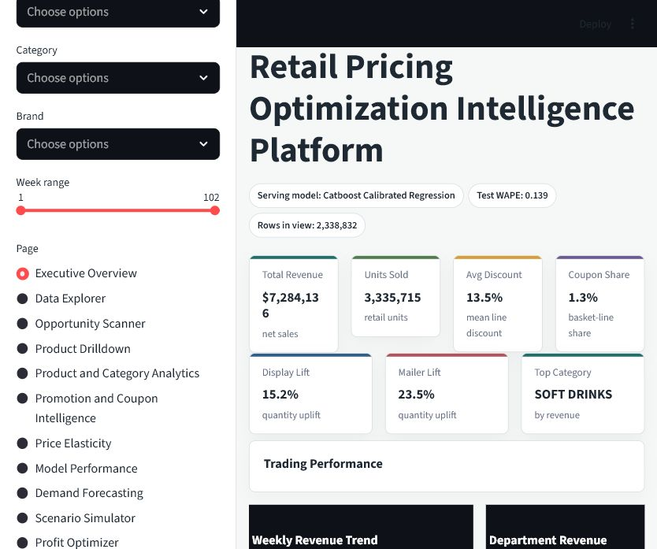

### Data Explorer

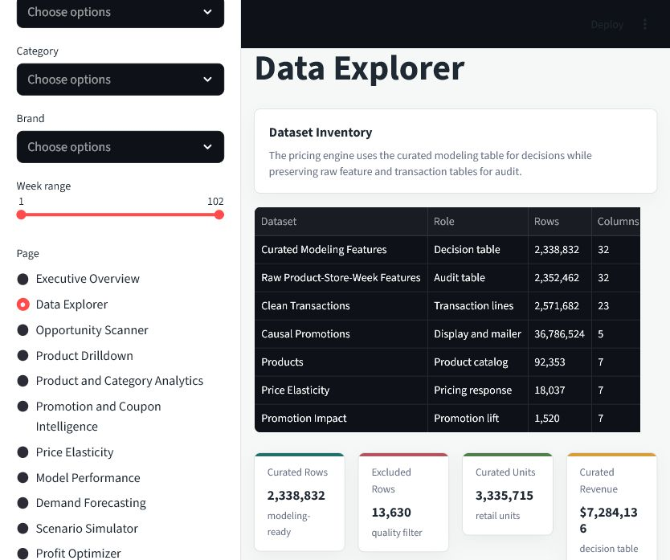

### Product Drilldown

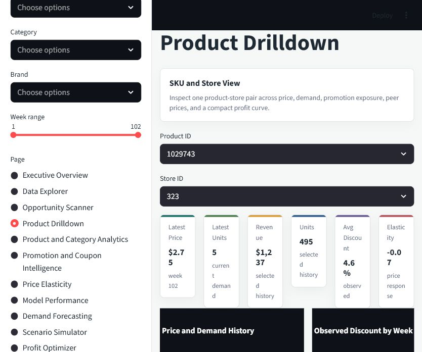

### Model Performance

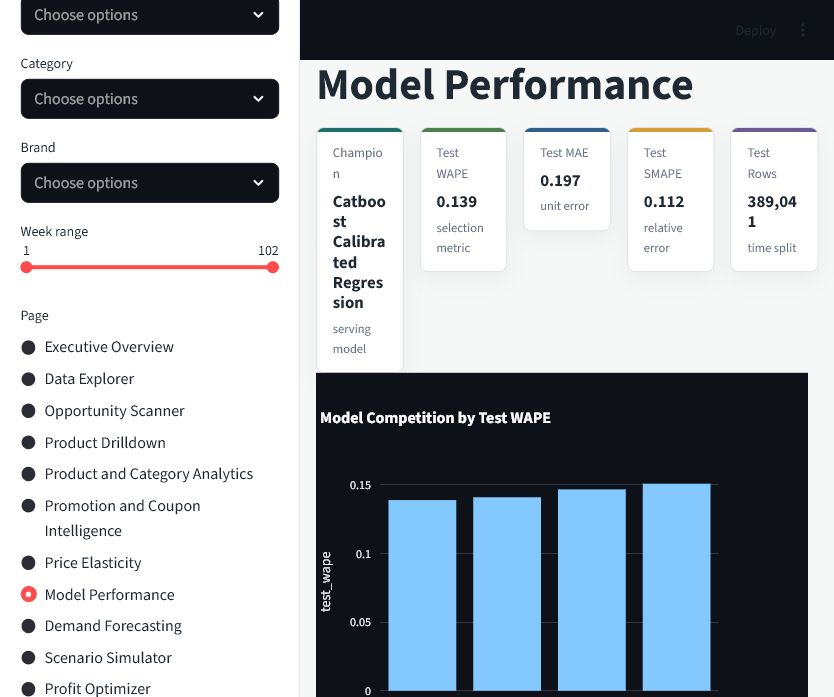

### Demand Forecasting

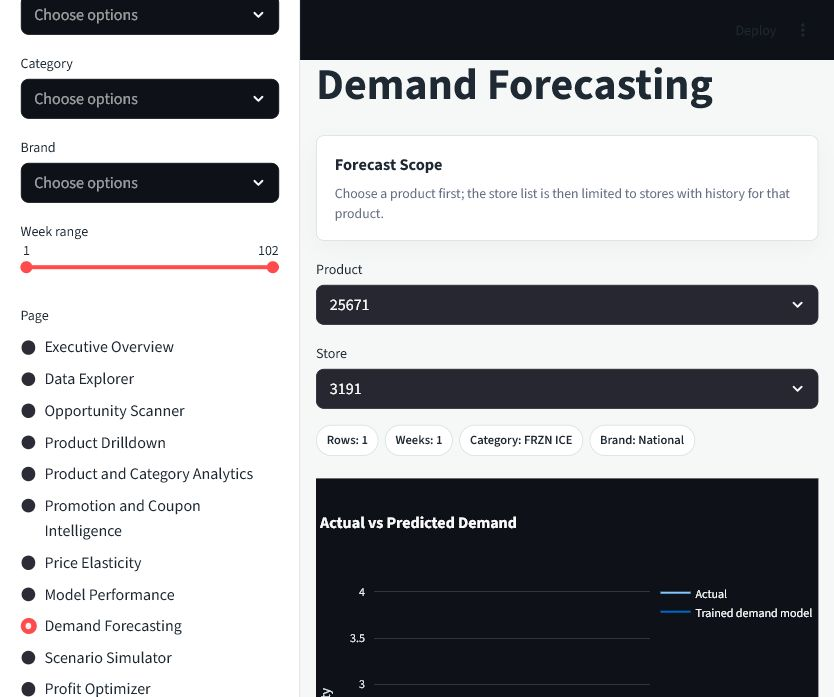

### Profit Optimizer

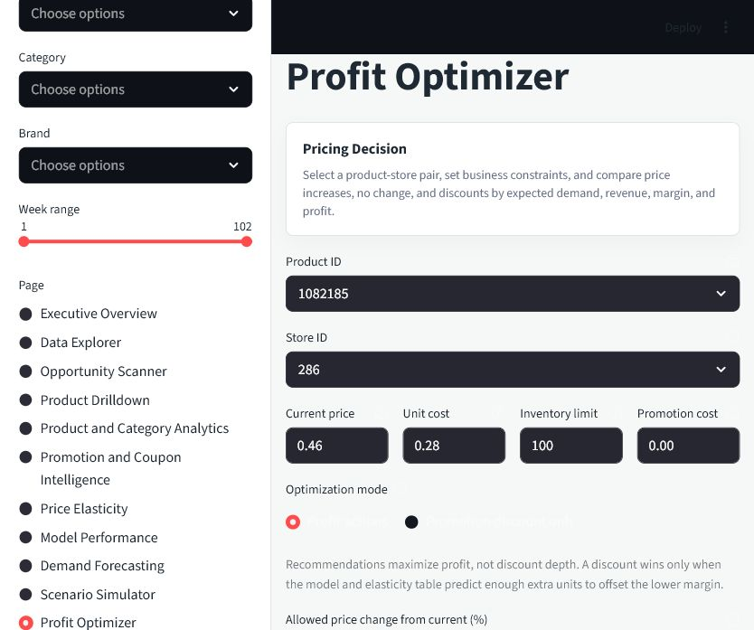

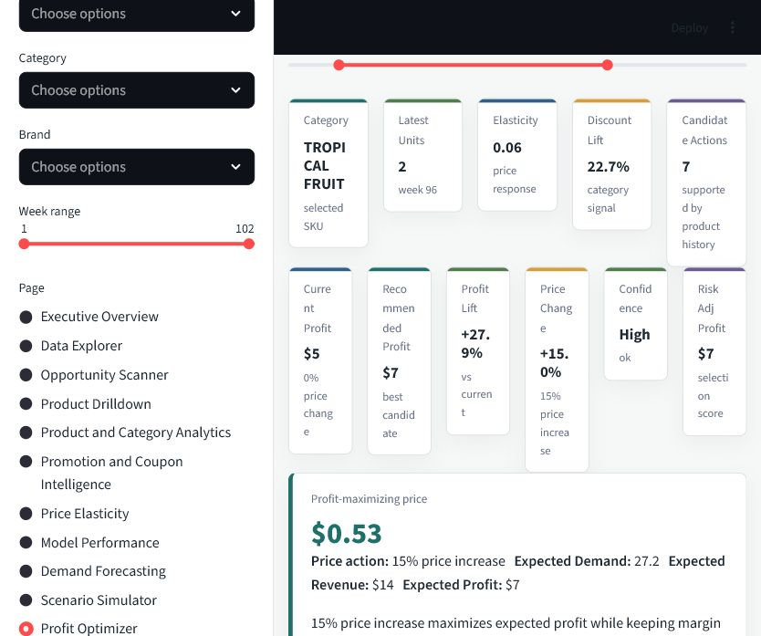

## Static Analysis and Model Plots

### Weekly Revenue

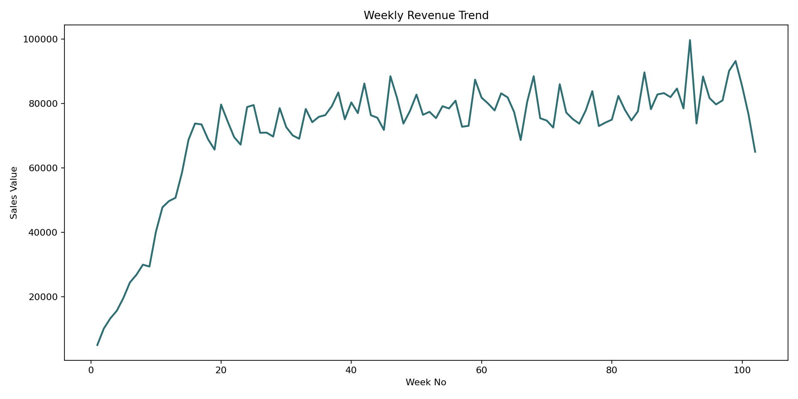

### Department Revenue

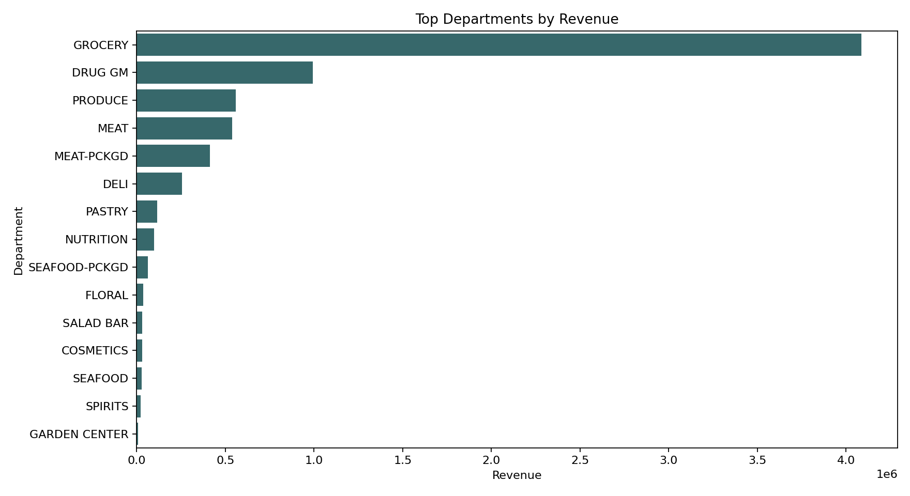

### Promotion Lift

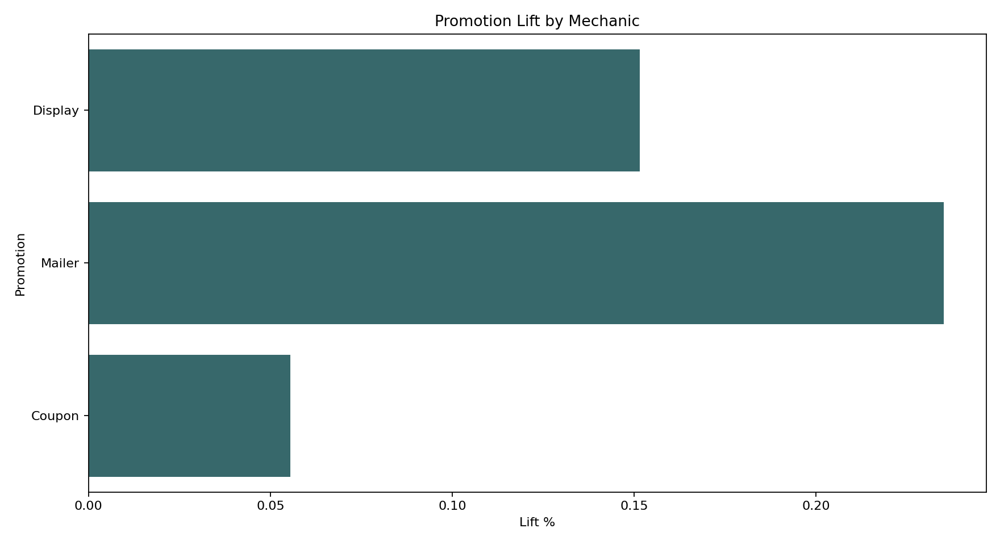

### Price Elasticity

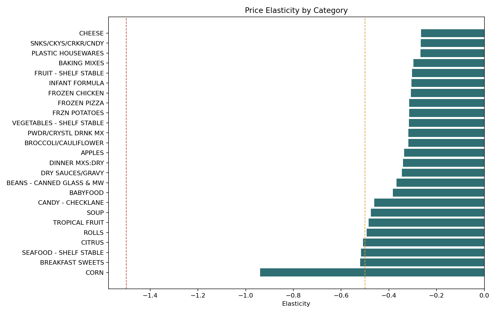

### Model Fit

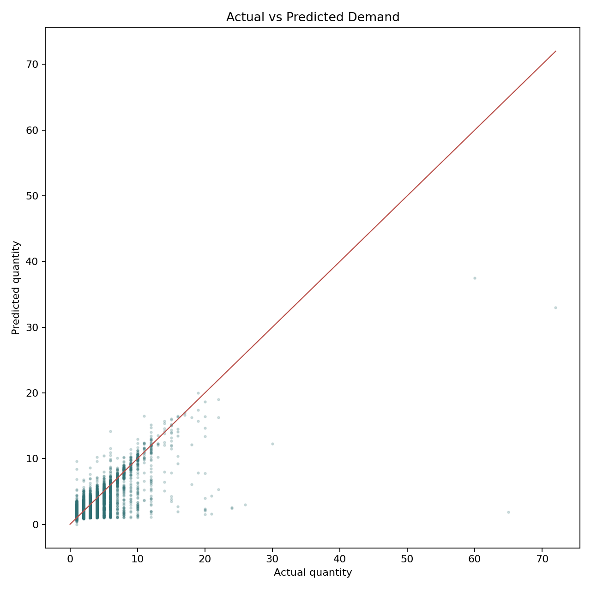

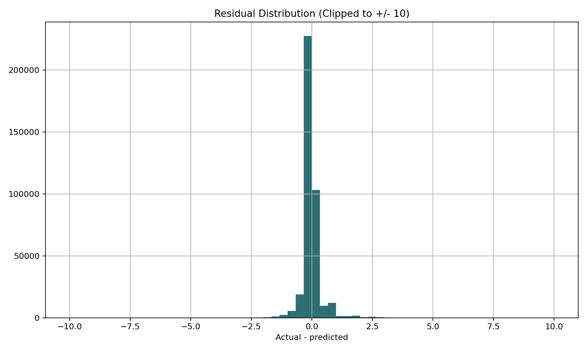

### Feature Importance

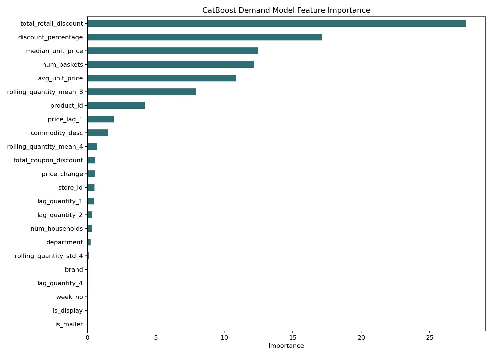

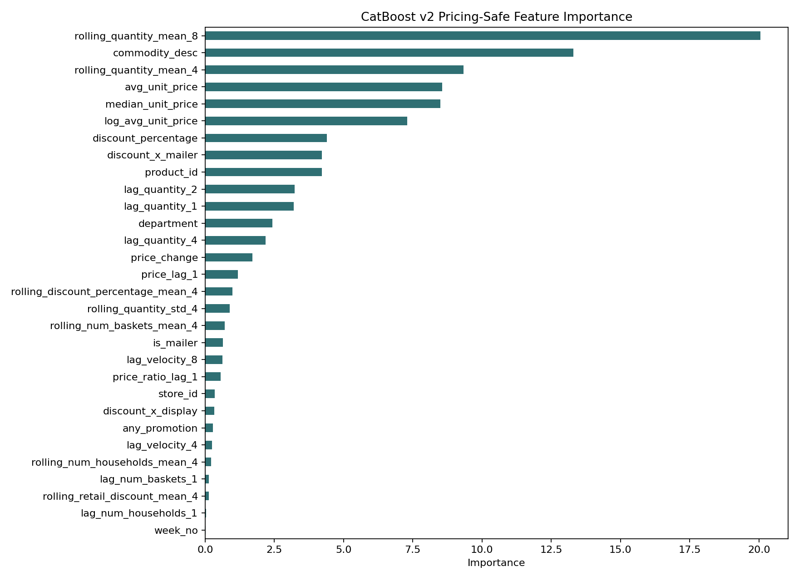

## What The Project Does

The project builds a full pipeline:

1. Loads the Dunnhumby Complete Journey CSV files.
2. Cleans product, transaction, promotion, coupon, campaign, and household tables.
3. Aggregates transactions into a product-store-week modeling table.
4. Engineers price, discount, promotion, lag, rolling demand, and category features.
5. Trains multiple demand forecasting models.
6. Selects a champion demand model by test WAPE.
7. Estimates category/product elasticity from historical price and quantity behavior.
8. Analyzes promotion, coupon, display, and mailer lift.
9. Simulates candidate prices and discounts using model predictions plus economics equations.
10. Exposes the workflow through a dashboard and API.

## Dataset

This project uses the Dunnhumby Complete Journey dataset. The local workspace used during development includes:

- `transaction_data.csv`
- `product.csv`
- `causal_data.csv`
- `coupon.csv`
- `coupon_redempt.csv`
- `campaign_table.csv`
- `campaign_desc.csv`
- `hh_demographic.csv`
- `dunnhumby - The Complete Journey User Guide.pdf`

The code can discover raw files from:

- `data/raw/`
- the downloaded nested Dunnhumby folder
- a custom directory set with `DUNNHUMBY_RAW_DIR`

Important GitHub note: raw data and model artifacts are intentionally ignored by `.gitignore`. The Dunnhumby files can be large and may have redistribution restrictions, so the repository should contain code, tests, README visuals, and lightweight documentation, not the raw dataset.

## Current Business Snapshot

From the current processed modeling table:

| Metric | Value |
|---|---:|
| Rows in dashboard view | 2,338,832 |
| Total revenue | $7,284,136 |
| Units sold | 3,335,715 |
| Average discount | 13.5% |
| Coupon sales share | 1.3% |
| Display promotion lift | 15.2% |
| Mailer promotion lift | 23.5% |
| Top revenue category | SOFT DRINKS |

## Feature Engineering

The feature table is built at product-store-week grain. It includes:

- product identifiers and metadata
- store identifiers
- department, category, commodity, sub-commodity, and brand
- week number and derived time features
- quantity sold
- sales value
- average and median unit price
- discount percentage
- display and mailer flags
- coupon and campaign indicators
- quantity lags
- rolling demand features
- price lag and price-change features
- promotion interaction features

The transaction pricing formulas follow the Dunnhumby guide:

```text
loyalty_card_price = (sales_value - (retail_disc + coupon_match_disc)) / quantity
non_loyalty_card_price = (sales_value - coupon_match_disc) / quantity
effective_unit_price = sales_value / quantity
shelf_price_estimate = (sales_value - retail_disc - coupon_match_disc) / quantity
```

The main processed tables are:

```text
data/processed/product_store_week_features.parquet
data/processed/retail_modeling_features.parquet
data/processed/price_elasticity_table.parquet
data/processed/promotion_impact_table.parquet
```

## Demand Forecasting Model

The current serving model is:

```text
CatBoost calibrated regression demand model
```

Why CatBoost:

- the data is mostly tabular retail data
- many features are categorical, such as product, store, department, category, and brand
- CatBoost handles categorical features well
- it outperformed the baseline LightGBM and production Poisson LightGBM models on test WAPE
- the compact neural model performed poorly in this pass, so a transformer is not the right next model until the data is reframed as a stronger sequential forecasting problem

The champion artifact is:

```text
models/champion_demand_model.pkl
reports/model_champion.json
```

Current champion metrics:

| Split | WAPE | MAE | RMSE | SMAPE |
|---|---:|---:|---:|---:|
| Validation | 0.1362 | 0.1931 | 0.5547 | 0.1092 |
| Test | 0.1388 | 0.1972 | 0.5593 | 0.1120 |

Training rows:

| Split | Rows |
|---|---:|
| Train | 1,575,205 |
| Validation | 374,586 |
| Test | 389,041 |

Model comparison by test WAPE:

| Model | Test WAPE | Notes |
|---|---:|---|
| CatBoost calibrated regression | 0.1388 | Current serving champion |
| CatBoost regression | 0.1408 | Strong raw CatBoost model |
| Baseline LightGBM regression | 0.1466 | Baseline model |
| Production LightGBM Poisson | 0.1507 | Count-style challenger |
| Compact neural model | 0.9999 | Not competitive in this pass |

## Pricing-Safe Model Work

A second CatBoost v2 family was trained for scenario-safe pricing. These models exclude leakage fields that are not known at decision time:

- `num_baskets`
- `num_households`
- `total_retail_discount`
- `total_coupon_discount`

The best pricing-safe candidate was:

```text
catboost_v2_weighted_mae
```

It is marked serving-safe, but it was not accepted as the production pricing model because its forecast accuracy was materially worse:

| Model | Test WAPE | Serving Safe | Accepted For Pricing |
|---|---:|---|---|
| CatBoost v2 weighted MAE | 0.2592 | Yes | No |
| CatBoost v2 RMSE | 0.3210 | Yes | No |
| CatBoost v2 Tweedie | 0.3334 | Yes | No |

The optimizer therefore uses the calibrated demand champion plus elasticity and guardrails for scenario decisions. This is more honest than serving a weaker pricing-safe model just because it is cleaner from a feature-leakage perspective.

## How The Optimizer Works

The optimizer does not blindly choose the biggest discount. It creates a candidate price grid and scores each action with demand, revenue, margin, and profit math.

Candidate actions can include:

- price increases
- no price change
- discounts
- promotion-only discount mode

The candidate grid is constrained by observed product or category price history where possible, so recommendations stay close to what the data has actually seen.

### Demand Equation

The demand simulation uses an isoelastic-style price response:

```text
Q_candidate = Q_base * (P_candidate / P_current) ^ elasticity * promotion_lift
```

Where:

- `Q_base` is the baseline model demand forecast
- `P_current` is the current price
- `P_candidate` is the scenario price
- `elasticity` estimates how demand responds to price movement
- `promotion_lift` adjusts expected quantity for discount, display, and mailer effects

### Revenue And Profit Equations

```text
revenue = candidate_price * predicted_quantity
contribution_margin = candidate_price - unit_cost
expected_profit = (candidate_price - unit_cost) * predicted_quantity - promotion_cost
```

Promotion cost is charged only when the scenario is a discount or promotion action.

### Risk-Adjusted Profit

The dashboard also calculates:

```text
incremental_profit = candidate_profit - baseline_profit
risk_adjusted_profit = baseline_profit + incremental_profit * confidence_multiplier
```

The confidence multiplier penalizes sparse or low-confidence scenarios. A recommendation has to clear a profit-lift threshold before it replaces the current price action.

### Guardrails

The recommendation layer checks:

- whether candidate prices are inside observed product/category price history
- whether product-store history is sparse
- whether margin stays above the minimum margin threshold
- whether demand exceeds inventory limits
- whether expected profit lift clears the threshold
- whether confidence is low, medium, or high

This is why the optimizer may recommend a price increase, a discount, or no change depending on the data. A discount only wins when the predicted extra units offset the lower contribution margin.

## Dashboard Pages

The Streamlit dashboard is located at:

```text
app/streamlit_app.py
```

Run it with:

```bash
python -m streamlit run app/streamlit_app.py --server.port 8501 --server.address 127.0.0.1
```

Pages:

- Executive Overview: revenue, units, average discount, coupon share, display lift, mailer lift, and top category
- Data Explorer: inspect the processed modeling table under filters
- Opportunity Scanner: find high-value pricing and promotion opportunities
- Product Drilldown: inspect product-store behavior and recent performance
- Product and Category Analytics: category, department, brand, and product views
- Promotion and Coupon Intelligence: display, mailer, coupon, campaign, and discount effects
- Price Elasticity: product and category price sensitivity
- Model Performance: champion model metrics, model competition, error bins, and safety notes
- Demand Forecasting: compare actual demand with trained model forecasts
- Scenario Simulator: manually test price and discount scenarios
- Profit Optimizer: recommend the best price action using forecast, elasticity, and profit equations

## API

The FastAPI app is located at:

```text
api/main.py
```

Run it with:

```bash
uvicorn api.main:app --reload
```

Endpoints:

| Endpoint | Method | Purpose |
|---|---|---|
| `/` | GET | API root |
| `/health` | GET | Health check |
| `/predict-demand` | POST | Predict quantity for a product/store/week row |
| `/recommend-price` | POST | Return the recommended price action |
| `/simulate-prices` | POST | Return all candidate scenario results |

Example pricing payload:

```json
{
  "product_id": 1082185,
  "store_id": 286,
  "current_price": 0.46,
  "unit_cost": 0.28,
  "candidate_discounts": [0, 5, 10, 15, 20],
  "inventory_limit": 100,
  "promotion_cost": 0
}
```

## Project Structure

```text
api/                         FastAPI service
app/                         Streamlit dashboard
docs/figures/                README-safe static plots
docs/screenshots/            README dashboard screenshots
notebooks/                   Analysis notebooks
reports/                     Metrics, diagnostics, generated reports
src/analytics/               Retail analytics
src/data/                    Data loading and cleaning
src/features/                Feature engineering and modeling-ready filtering
src/models/                  Model training, calibration, diagnostics, serving wrappers
src/optimization/            Profit optimizer and scenario simulation
src/pricing/                 Elasticity and pricing intelligence
src/promotion/               Promotion and coupon impact analysis
tests/                       Unit tests
```

## Reproducing The Pipeline

Install dependencies:

```bash
python -m venv .venv
.venv\Scripts\activate
python -m pip install --upgrade pip
python -m pip install -r requirements.txt
```

Load raw data:

```bash
python -m src.data.load_data
```

Clean data:

```bash
python -m src.data.clean_data
```

Build product-store-week features:

```bash
python -m src.features.build_features
```

Create the modeling-ready table:

```bash
python -m src.features.filter_modeling_ready
```

Generate retail analytics:

```bash
python -m src.analytics.retail_analytics
```

Train baseline and challenger models:

```bash
python -m src.models.train_baseline
python -m src.models.train_production
python -m src.models.train_catboost
python -m src.models.calibrate_demand_model
python -m src.models.select_champion
```

Train pricing-safe CatBoost v2 candidates:

```bash
python -m src.models.train_catboost_v2
```

Estimate elasticity and promotion effects:

```bash
python -m src.pricing.elasticity
python -m src.promotion.promotion_impact
```

Generate diagnostics:

```bash
python -m src.models.model_diagnostics
```

Run tests:

```bash
python -m pytest
```

Current local test result:

```text
22 passed
```

## Key Tests

The test suite checks:

- API health and endpoint contracts
- feature engineering validity
- modeling-ready filter behavior
- price calculation formulas
- model wrapper behavior
- serving-safe feature exclusions
- scenario feature updates
- optimizer guardrails
- profit-lift threshold behavior
- economics metrics such as break-even quantity and risk-adjusted profit

## Why This Project Is Significant

This is more than a dashboard. It includes the main pieces expected in a practical retail pricing analytics system:

- large-scale retail transaction processing
- demand forecasting with model comparison
- model calibration and champion selection
- leakage-aware pricing model experiments
- elasticity estimation
- promotion and coupon impact analysis
- explainable profit simulation
- Streamlit business dashboard
- FastAPI inference service
- tests for pricing logic and serving safety
- GitHub-ready documentation with visuals

The current optimizer is still decision support, not causal proof. For production pricing, the next step would be to combine this with controlled experiments, causal uplift modeling, and real cost-of-goods data.

## Known Limitations

- The optimizer uses estimated unit cost unless real COGS is supplied.
- Elasticity is historical and observational, so it should not be interpreted as guaranteed causal response.
- Some rare product-store combinations have sparse history and receive lower confidence.
- High-demand weeks remain harder for the champion model than low-demand weeks.
- The pricing-safe CatBoost v2 model is not yet accurate enough to replace the calibrated demand champion.
- The neural model was exploratory and is not competitive in the current tabular setup.

## Strong Next Improvements

- Add causal uplift modeling for discounts and promotions.
- Add cross-price elasticity to account for substitutes and complements.
- Add hierarchical elasticity pooling across product, category, department, and brand.
- Add real COGS and vendor funding fields.
- Add stockout detection and lost-sales correction.
- Backtest optimizer recommendations on historical promotion windows.
- Add MLflow experiment tracking.
- Add SHAP explanations for demand and pricing recommendations.
- Add a GitHub release with lightweight sample data for demo runs.

## GitHub Push Notes

Before pushing, keep these files out of the repository:

- raw Dunnhumby CSV files
- processed parquet files
- trained model binaries
- local logs and PID files
- virtual environments

The README images are stored in `docs/` so GitHub can render them without committing the full `reports/figures` output directory.

Example first push:

```bash
git init
git add .
git commit -m "Add retail pricing optimization platform"
git branch -M main
git remote add origin https://github.com/<your-user>/<your-repo>.git
git push -u origin main
```

